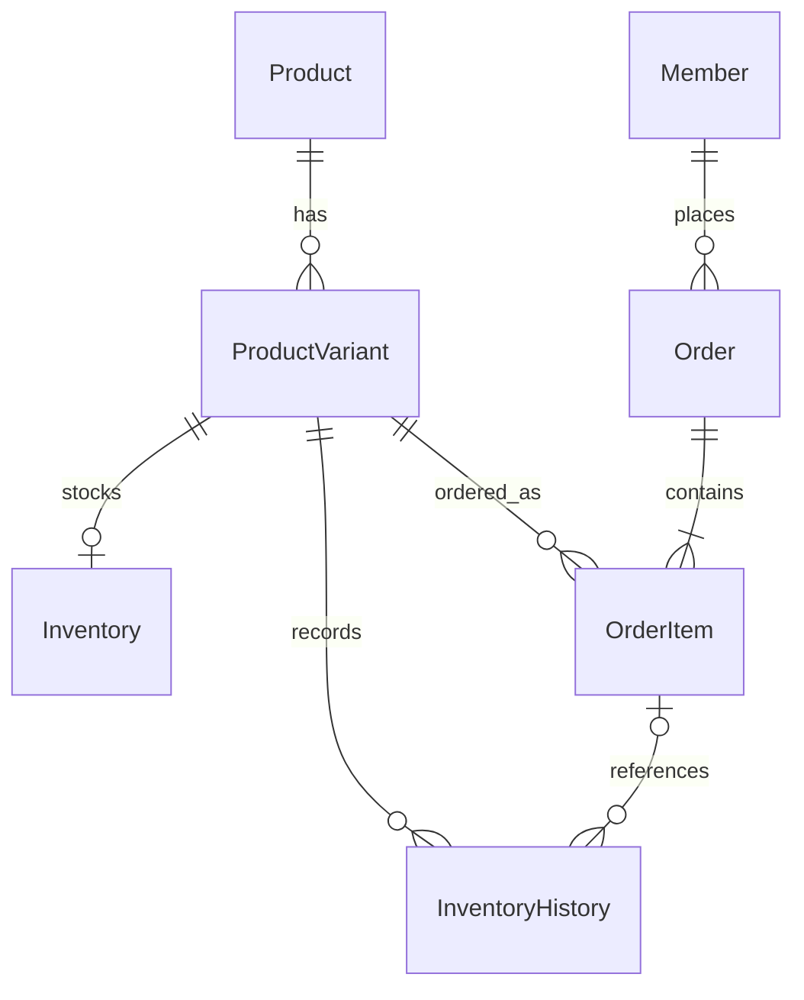
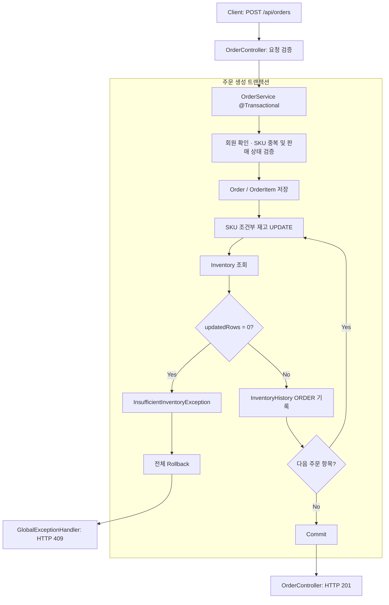

# Order Inventory Service

Spring Boot 기반 주문·재고 서비스로, 동시 주문에서 발생하는 **Lost Update와 Overselling을 직접 재현하고 다섯 가지 동시성 제어 전략을 비교**한 백엔드 프로젝트입니다.
Phase 1의 주문 생성 전략으로 Conditional Atomic Update를 선택했으며, 실제 MySQL Testcontainers 환경에서 주문·재고·이력의 정합성과 실패 시 rollback을 자동 검증합니다.

[동시성 실험 결과](docs/phase1/03-concurrency-benchmark.md) · [업무 규칙](docs/phase1/02-business-rules.md) · [MySQL 통합 테스트](backend/src/test/java/com/eastwest9/orderinventory/order/integration/OrderInventoryConcurrencyIntegrationTest.java)

## 1. 프로젝트 소개

여러 사용자가 같은 SKU를 동시에 주문할 때, 각 주문이 정상 응답을 받아도 실제 재고가 올바르게 차감됐다고 단정할 수는 없습니다. 이 프로젝트는 상품·주문 API 구현에서 출발해 다음 질문을 실험으로 확인하는 데 초점을 맞췄습니다.

- 동시 주문에서 재고는 어떤 과정으로 깨지는가?
- Overselling과 Lost Update를 어떻게 막을 것인가?
- 여러 동시성 전략 중 현재 재고 불변식에 적합한 것은 무엇인가?
- 선택한 전략이 실제 MySQL에서도 주문·재고·이력을 일치시키는가?

Phase 1의 핵심 목표는 **성공 주문 수량 = 실제 재고 감소량 = 주문 재고 이력 감소량**을 유지하고, 실패한 주문의 부분 데이터가 남지 않도록 하는 것입니다. 회원은 주문 소유자를 나타내는 최소 모델이며, 인증·장바구니·결제·배송은 현재 구현 범위에 포함하지 않습니다. [프로젝트 범위](docs/phase1/01-project-charter.md)

## 2. 기술 스택

| 영역 | 기술 |
|---|---|
| Language / Framework | Java 21, Spring Boot 4.1.0 |
| Persistence | Spring Data JPA, MySQL 8.4, Flyway |
| Build | Gradle 9.5.1 Wrapper |
| Test | JUnit Jupiter, Spring Boot Test, Mockito, Testcontainers |
| Local infrastructure | Docker, Docker Compose |
| Reference benchmark | PowerShell 7, `ForEach-Object -Parallel` |

## 3. 시스템 구조

`product`, `inventory`, `order`, `member`, `common`의 도메인별 패키지로 구성합니다. Controller는 HTTP 입출력, Service는 트랜잭션과 유스케이스 조정, Domain은 업무 규칙, Repository는 데이터 접근을 담당합니다.



가격과 재고의 관리 단위는 SKU인 `ProductVariant`입니다. SKU 등록과 초기 재고 생성은 별도 작업이며, SKU당 Inventory는 최대 하나입니다. InventoryHistory는 SKU를 직접 참조하고, 주문 관련 이력만 `order_item_id`로 주문 항목과 연결합니다.

스키마는 Flyway migration으로 관리하며 PK·FK, SKU 중복 방지, 재고 음수 방지, 이력 전후 수량 일치 조건을 DB 제약으로 정의합니다. [상세 ERD](docs/database/04-phase1-erd.md)

## 4. 핵심 기능

| 기능 | 주요 동작 |
|---|---|
| 상품·SKU 등록 및 조회 | 상품과 SKU를 함께 등록하고 중복 SKU를 거부합니다. 판매 중인 상품·SKU만 주문할 수 있습니다. |
| 재고 관리 | SKU별 초기 재고 생성, 입고, 수량 조정, 현재 재고 및 변경 이력 조회를 제공합니다. |
| 주문 생성·조회 | 주문 시점의 상품명·옵션명·가격을 OrderItem에 보존하고, 주문 저장·재고 차감·ORDER 이력 기록을 하나의 트랜잭션으로 처리합니다. |
| 주문 취소 | 상태를 `CREATED → CANCELED`로 변경하고 재고 복구와 ORDER_CANCEL 이력을 함께 반영합니다. 이미 취소된 주문은 거부합니다. |
| 재고 부족·실패 처리 | 차감에 실패하면 주문 전체를 rollback합니다. API에서는 `INSUFFICIENT_INVENTORY` 코드와 HTTP 409를 반환합니다. |

재고 변경은 `INITIAL`, `RECEIPT`, `ORDER`, `ORDER_CANCEL`, `ADJUSTMENT` 이력으로 남깁니다. 금액은 Java `BigDecimal`과 MySQL `DECIMAL`을 사용합니다.

## 5. 주문과 재고 처리 흐름

[OrderService.createOrder()](backend/src/main/java/com/eastwest9/orderinventory/order/service/OrderService.java)는 주문 항목을 저장한 뒤 각 SKU에 대해 조건부 UPDATE를 실행합니다.



위 흐름은 회원·SKU·재고가 존재하는 경우의 성공/재고 부족 경로입니다. 주문 취소도 별도 서비스 트랜잭션 안에서 상태 변경, 재고 복구, 이력 기록을 처리합니다. **동시성 실험과 아래 자동 검증의 대상은 주문 생성**이며, 취소·입고·조정이 동시에 섞인 상황까지 검증한 것은 아닙니다.

## 6. 동시성 문제 재현

NO_LOCK baseline에서 초기 재고 **100개**, 요청 **1,000건**, 요청당 **1개**, parallelism **50**으로 동일 SKU에 주문을 집중했습니다.

5회 모두 최종 재고는 0이었지만, 성공 주문·ORDER 이력 건수와 감소량은 평균 **311.4**였습니다. 실제 재고는 100개만 감소했으므로 평균 **211.4개 초과 판매**, **211.4의 Lost Update gap**이 발생했습니다.

원인은 여러 트랜잭션이 같은 재고를 읽고 각각 차감한 값을 덮어쓰는 read-modify-write 경쟁입니다. 예를 들어 두 주문이 모두 `100 → 99`를 저장하면 주문과 이력은 두 건이지만 재고 감소는 한 번만 남습니다.

**최종 재고가 0인지 확인하는 것만으로는 동시성 오류를 발견할 수 없습니다.** 성공 주문, 주문 항목, 이력, 실제 재고 감소량을 함께 비교해야 합니다. [Run별 결과와 원인 분석](docs/phase1/03-concurrency-benchmark.md)

## 7. 동시성 전략 비교

동일한 재고·요청 수·수량·parallelism 조건으로 비교했습니다. NO_LOCK은 5회, 나머지 전략은 각 3회 실행했으며 아래 값은 문서에 기록된 Run별 지표의 평균입니다.

| Strategy | Correctness | Avg Elapsed (s) | Avg Attempted TPS | Avg Success TPS | 특징 |
|---|---|---:|---:|---:|---|
| NO_LOCK | FAIL (5/5) | 16.709 | 63.29 | 미기록 | Lost Update 및 초과 판매 |
| SYNCHRONIZED | PASS (3/3) | 21.903 | 46.08 | 4.61 | 단일 JVM monitor로 직렬화 |
| OPTIMISTIC_NO_RETRY | PASS (3/3) | 13.899 | 73.47 | 7.35 | version conflict 평균 23.5%, retry 없음 |
| PESSIMISTIC_LOCK | PASS (3/3) | 12.514 | 81.83 | 8.18 | SELECT FOR UPDATE 후 재고 확인·변경 |
| CONDITIONAL_ATOMIC_UPDATE | PASS (3/3) | 10.812 | 92.63 | 9.26 | 조건 검사·차감을 하나의 UPDATE로 처리 |

PowerShell 기반 로컬 **reference benchmark**입니다. 절대적인 성능 평가가 아니라 동일 환경에서 전략별 동작과 경향을 비교하기 위한 실험이며, 반복 횟수 차이와 부하 생성 도구·실행 시점의 영향을 고려해야 합니다. NO_LOCK의 Success TPS는 원문에 없어 계산하지 않았습니다.

이 표는 전략을 순차 적용한 실험 기록입니다. 현재 주문 생성 경로는 Conditional Atomic Update를 사용합니다. [상세 실험 및 최종 비교](docs/phase1/03-concurrency-benchmark.md)

## 8. 왜 Conditional Atomic Update를 선택했는가

현재 불변식은 **“특정 SKU의 재고가 요청 수량 이상일 때 차감한다”**입니다. [InventoryRepository](backend/src/main/java/com/eastwest9/orderinventory/inventory/repository/InventoryRepository.java)의 JPQL은 이 조건을 직접 표현합니다.

```sql
update Inventory i
set i.quantity = i.quantity - :quantity
where i.productVariant.id = :variantId
  and i.quantity >= :quantity
```

- 재고 확인·조건 검사·차감을 하나의 DB UPDATE로 처리해 application의 read-modify-write 경쟁과 Lost Update를 방지합니다.
- 단일 JVM monitor에 의존하지 않고, optimistic no-retry 방식의 version conflict 실패를 요구하지 않습니다.
- 현재처럼 단순한 조건에서는 별도 SELECT FOR UPDATE 후 수정하는 방식보다 차감 구조가 간결합니다. 성공 후 이력 작성을 위한 조회는 유지합니다.
- Reference benchmark에서도 정합성을 유지한 전략 중 평균 elapsed가 가장 짧았습니다. 선택의 주된 근거는 최고 TPS 자체보다 **현재 불변식과 구현 복잡도의 적합성**입니다.

이 방식도 **lock-free는 아닙니다**. InnoDB row lock contention이 발생할 수 있고, 다중 SKU를 서로 다른 순서로 갱신하면 deadlock이 생길 수 있습니다. 복잡한 multi-row invariant에는 pessimistic lock 등이 더 적절할 수 있으며, 높은 트래픽의 요청 유입 제어·queue 같은 별도 계층의 설계까지 이 UPDATE로 해결되는 것은 아닙니다. Deadlock·retry 정책은 후속 검증 대상입니다. [선택 근거와 한계](docs/phase1/03-concurrency-benchmark.md)

## 9. 실제 MySQL에서의 자동 검증

[OrderInventoryConcurrencyIntegrationTest](backend/src/test/java/com/eastwest9/orderinventory/order/integration/OrderInventoryConcurrencyIntegrationTest.java)는 MySQL 8.4 컨테이너를 자동 시작·종료하고 Flyway migration을 적용합니다. 테스트 클래스에 `@Transactional`을 두지 않고 fixture를 먼저 커밋한 뒤, 50개 worker가 latch로 시작을 맞춰 실제 OrderService의 개별 트랜잭션을 호출합니다.

초기 재고 20개에 동일 SKU 주문 50건을 요청당 1개씩 실행한 검증 결과입니다.

| 성공 | 재고 부족 | 기타 예외 | 최종 재고 |
|---:|---:|---:|---:|
| 20 | 30 | 0 | 0 |

```text
성공 요청 수 = 실제 성공 Order 수 = OrderItem 수 = 성공 주문 수량 합
           = ORDER 이력 건수 = 이력 감소량 = 실제 재고 감소량 = 20
```

이번 테스트의 회원·SKU 범위로 DB를 조회하고, `20 → 19`부터 `1 → 0`까지 각 이력 전이가 한 번씩 존재하는지 확인합니다. 해당 시나리오에서 Overselling, Lost Update, 재고 음수가 없음을 검증합니다.

Rollback은 두 경우를 검증합니다.

- 단일 SKU: 재고 1개에 2개 주문 시 재고를 유지하고 Order·OrderItem·ORDER 이력이 남지 않습니다.
- 다중 SKU: 첫 SKU 차감 후 두 번째 SKU에서 재고가 부족하면, **앞서 차감한 첫 SKU까지 전체 rollback**됩니다. 초기 재고와 INITIAL 이력만 유지됩니다.

재고 부족 예외의 `availableQuantity`는 REPEATABLE_READ의 snapshot 조회로 최신 수량과 다를 수 있습니다. 동시성 테스트는 이 값을 기록하며, 차감 정합성과 별도로 단건 부족 시 가용 수량을 검증합니다.

## 10. 테스트 실행

Java 21과 실행 중인 Docker 엔진이 필요합니다. Windows PowerShell에서 저장소 루트를 기준으로 실행합니다.

```powershell
cd backend
.\gradlew.bat test --tests "*OrderInventoryConcurrencyIntegrationTest"
.\gradlew.bat clean test
```

MySQL 통합 테스트는 전용 `mysql-integration` profile과 동적 datasource 설정을 사용하므로 로컬 애플리케이션용 DB를 미리 구성하거나 실행할 필요가 없습니다. 최초 실행에는 Gradle 의존성과 컨테이너 이미지 다운로드가 필요할 수 있습니다. 기존 `test` profile의 H2 컨텍스트 로딩 테스트와 MySQL 동시성 통합 테스트는 별도로 구성되어 있습니다.

## 11. 프로젝트 구조

```text
order-inventory-service/
├─ backend/
│  ├─ src/main/java/com/eastwest9/orderinventory/
│  │  ├─ product/
│  │  ├─ inventory/
│  │  ├─ order/
│  │  ├─ member/
│  │  └─ common/
│  ├─ src/main/resources/db/migration/
│  └─ src/test/java/com/eastwest9/orderinventory/
├─ docs/
│  ├─ phase1/
│  ├─ database/
│  └─ conventions/
├─ infra/compose.yaml
└─ README.md
```

## 12. Phase 1 결과

상품·재고·주문의 기본 API와 스키마를 구현한 뒤 주문 생성·취소를 재고 및 이력과 하나의 트랜잭션으로 연결했습니다. 이후 NO_LOCK에서 정합성 훼손을 재현하고, 다섯 전략을 같은 부하 조건으로 비교해 Conditional Atomic Update를 선택했습니다. 마지막으로 실제 MySQL에서 동시 주문과 단건·다중 SKU 실패의 rollback을 자동 검증했습니다.

Phase 1의 핵심 결과는 **주문 응답이나 최종 재고 하나에 의존하지 않고, 커밋된 주문·이력·재고를 대조하는 검증 기준을 마련한 것**입니다.

## 13. 다음 단계

다음은 현재 구현된 기능과 구분한 향후 계획입니다.

- [실험 문서](docs/phase1/03-concurrency-benchmark.md)의 후속 과제: 부하 생성 도구와 측정 방식 개선, 다중 SKU의 lock wait·deadlock 및 retry 정책 검증.
- [프로젝트 범위 문서](docs/phase1/01-project-charter.md)의 확장 방향: 회원가입·인증, 장바구니, 결제·배송 도입과 주문 lifecycle 확장. Redis·Kafka는 이후 확장 범위이며 현재 적용하지 않았습니다.
- 프로젝트 완료 기준에 명시된 GitHub Actions CI 구성은 후속 과제로 남아 있습니다.
